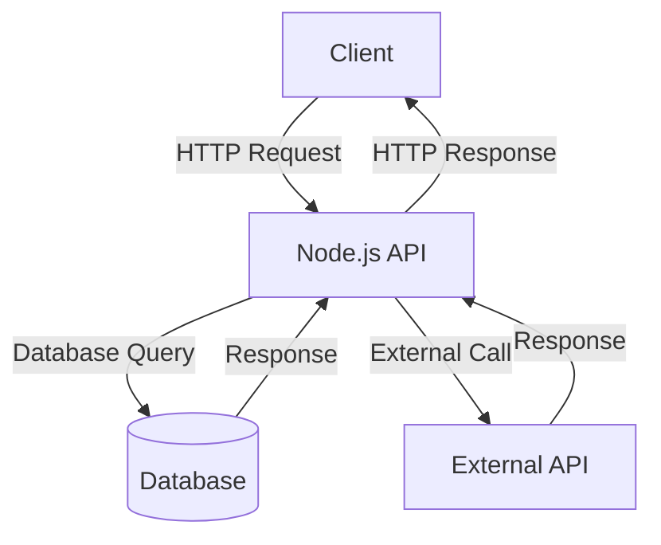
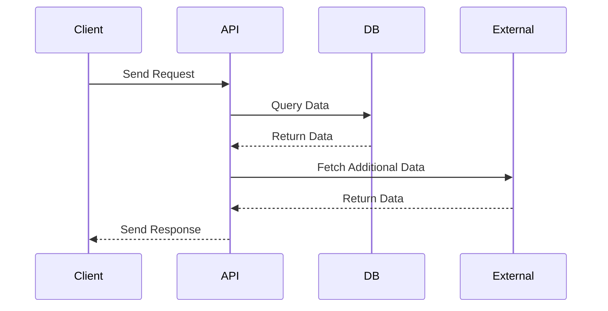

# Sample Node.js Application

This document provides an overview of a sample Node.js application, including its architecture and workflow.

## Application Architecture

The following diagram illustrates the architecture of the Node.js application:

## Workflow

The workflow of the application is depicted below:

## Key Features

- **RESTful API**: Built using Express.js.
- **Database Integration**: Supports MongoDB or PostgreSQL.
- **External API Calls**: Fetches data from third-party services.

## References

- [Node.js Documentation](https://nodejs.org/en/docs/)
- [Express.js Guide](https://expressjs.com/)
- [Mermaid.js Documentation](https://mermaid-js.github.io/mermaid/#/)
